# PetFit — AI-Powered Personalized Canine Nutrition & Health Management

> **반려견의 건강정보와 사료 영양정보를 결합하여, 개인화된 사료 적합도·급여량·건강 위험도·주변 동물병원 정보를 제공하는 AI 기반 반려견 건강관리 프로토타입**

PetFit은 단순히 “좋은 사료”를 추천하는 것이 아니라,
**반려견의 나이, 체중, 생애주기, 활동량, 알레르기, 기저질환과 실제 사료 영양성분을 함께 비교하여
“이 사료가 우리 아이에게 얼마나 잘 맞는가?”를 분석하는 것**에서 시작한 프로젝트입니다.

🌐 **Live Demo:** https://stately-kataifi-033343.netlify.app/

---

## Prototype Overview

<table>
  <tr>
    <td width="33.3%" align="center">
      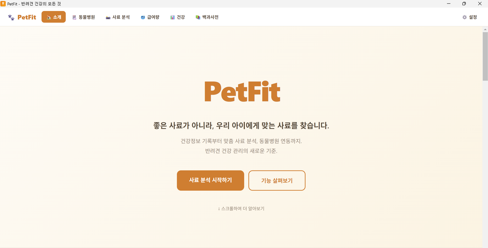
      <br>
      <sub><b>PetFit Main</b><br>서비스 메인 화면</sub>
    </td>
    <td width="33.3%" align="center">
      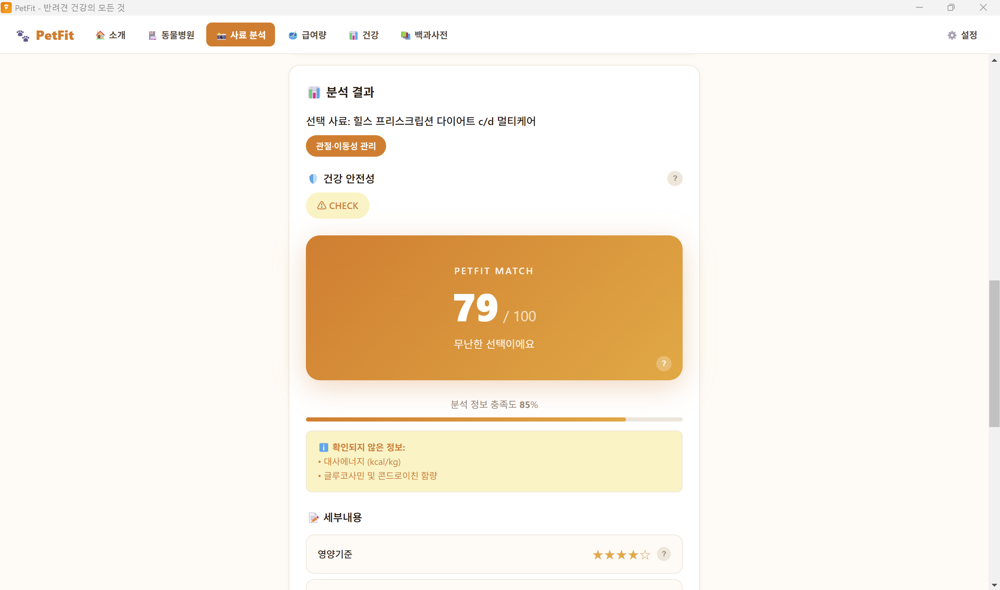
      <br>
      <sub><b>PetFit Match</b><br>개인화 사료 적합도 분석 결과</sub>
    </td>
    <td width="33.3%" align="center">
      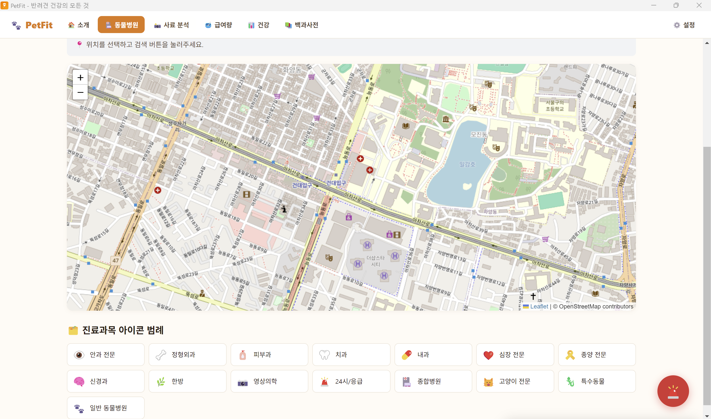
      <br>
      <sub><b>Vet Map</b><br>위치 기반 주변 동물병원 검색</sub>
    </td>
  </tr>
</table>

---

## Project Highlights

* 📷 **Multimodal AI Food Analysis**
  사료 영양성분표 이미지를 Google Gemini에 입력하여 영양정보와 적합도 평가 항목을 구조화합니다.

* 🎯 **PetFit Match Scoring**
  영양기준, 체중·에너지, 생애주기, 건강관리 목표 등을 가중 결합하여 100점 기준의 개인화 적합도를 계산합니다.

* 🛡️ **Safety Gate**
  최종 점수와 별도로 알레르기 원료 및 기저질환 관련 식이 주의사항을 검사하여 `PASS / CHECK / STOP`으로 판정합니다.

* 🍚 **RER / DER-based Feeding Calculator**
  체중과 생애주기를 이용해 필요 열량을 계산하고, 사료 열량 및 간식 섭취량을 반영하여 실제 급여량을 산출합니다.

* 📊 **Rule-based Health Profile**
  반려견의 현재 건강·생활정보와 견종 특성을 바탕으로 생활패턴과 주요 건강 위험 요소를 시각화합니다.

* 🏥 **Location-based Veterinary Search**
  Kakao Local API로 동물병원 정보를 검색하고 Leaflet + OpenStreetMap으로 지도에 표시합니다.

* 🚨 **Emergency Guide & AI Consultation**
  주요 응급상황별 행동 지침과 Gemini 기반 AI 상담 기능을 제공합니다.

* 📚 **Dog Encyclopedia & AI Search**
  견종·질병·음식 정보를 로컬 지식 DB에서 조회하고, 필요 시 Gemini 기반 추가 설명을 제공합니다.

* 🖥️ **Web + Windows Desktop Packaging**
  웹 프로토타입을 단일 HTML로 빌드하고 Electron을 이용해 Windows 데스크톱 애플리케이션으로 패키징할 수 있습니다.

---

# System Architecture

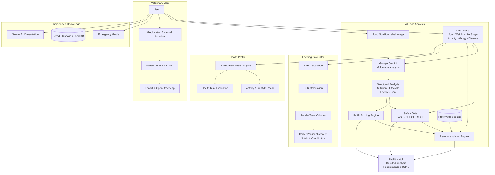

PetFit은 하나의 AI 모델에 모든 판단을 맡기는 구조가 아니라,

**Multimodal AI 분석 + 명시적인 점수 계산 + Safety Gate + 규칙 기반 건강 분석 + 외부 위치 API**

를 조합하는 방식으로 구성했습니다.

---

# Core Features

## 1. AI-based Personalized Food Analysis

반려견 프로필과 건강관리 목표를 입력한 뒤 사료 영양성분표 이미지를 업로드하면
Gemini Multimodal API가 이미지에서 정보를 추출하고 반려견 상태와 비교합니다.

<table>
  <tr>
    <td width="50%" align="center">
      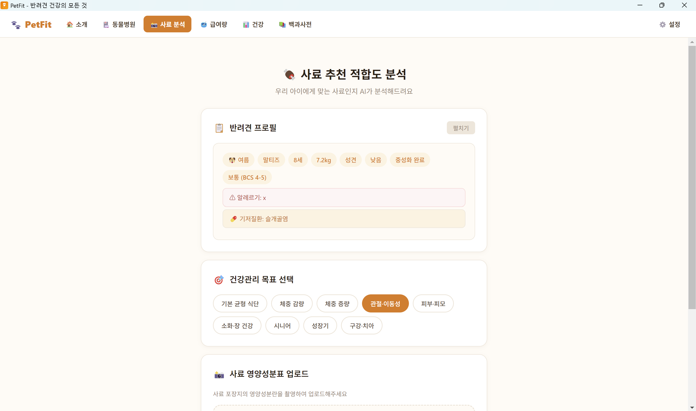
      <br>
      <sub><b>Dog Profile & Health Goal</b></sub>
    </td>
    <td width="50%" align="center">
      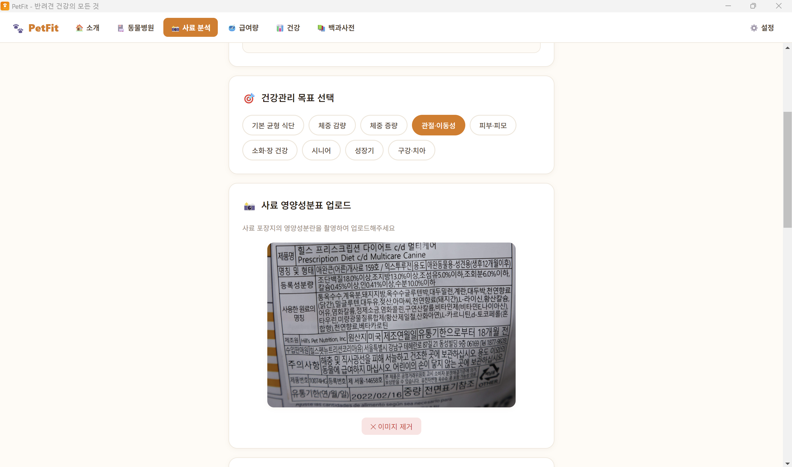
      <br>
      <sub><b>Nutrition Label Image Upload</b></sub>
    </td>
  </tr>
</table>

### Analysis Input

* 견종 / 연령 / 체중
* 중성화 여부
* 체형 및 활동량
* 생애주기
* 알레르기
* 기저질환
* 건강관리 목표
* 사료 영양성분표 이미지

Gemini의 응답은 JSON 형태로 구조화하여 다음 점수를 추출합니다.

| Component                  | Description          |  Weight |
| -------------------------- | -------------------- | ------: |
| **N — Nutrition**          | 영양기준 및 영양 균형 적합성     | **45%** |
| **E — Weight & Energy**    | 체중·체형·활동량 대비 에너지 적합성 | **20%** |
| **L — Life Stage**         | 현재 생애주기와 사료 대상의 일치도  | **15%** |
| **G — Health Goal**        | 선택한 건강관리 목표와의 적합성    | **15%** |
| **T — Feeding Experience** | 과거 급여 경험             |  **5%** |

### PetFit Match

```text
PetFit Score
= 0.45N + 0.20E + 0.15L + 0.15G + 0.05T
```

`기본 균형 식단(BASIC)`을 선택한 경우에는 별도의 건강관리 목표 점수 `G`를 제외하고
나머지 항목을 다시 100점 기준으로 정규화합니다.

```text
PetFit_BASIC
= (0.45N + 0.20E + 0.15L + 0.05T) / 0.85
```

> 현재 프로토타입에서 `Feeding Experience(T)`는 실제 장기 급여 이력과 아직 연동되지 않았으며 중립값 50으로 처리됩니다.

### Safety Gate

PetFit 점수와 별도로 안전성 검사를 수행합니다.

```text
Registered Allergy
        │
        ├── Ingredient Conflict → STOP
        │
Underlying Disease
        │
        ├── Dietary Warning → CHECK
        │
        └── No Conflict → PASS
```

따라서 높은 점수가 나오더라도 알레르기 또는 식이 금기 가능성이 확인되면
이를 별도의 안전성 경고로 사용자에게 표시합니다.

### Analysis Result

<table>
  <tr>
    <td width="50%" align="center">
      
      <br>
      <sub><b>PetFit Match & Safety Gate</b></sub>
    </td>
    <td width="50%" align="center">
      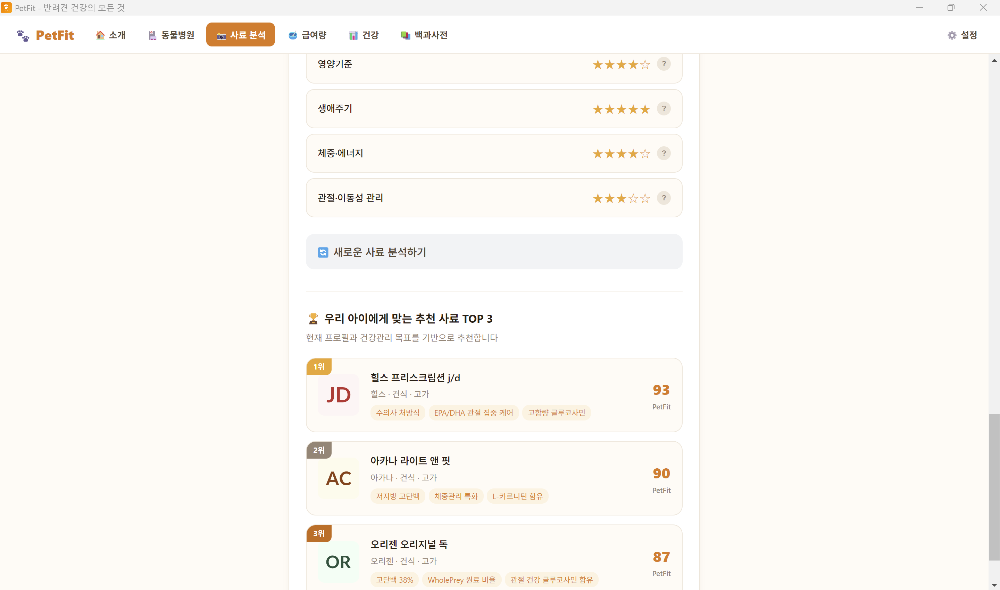
      <br>
      <sub><b>Detailed Score & Recommended Food TOP 3</b></sub>
    </td>
  </tr>
</table>

분석 결과에는 다음 정보를 제공합니다.

* `PetFit Match / 100`
* `PASS / CHECK / STOP` 안전성 판정
* 분석 정보 충족도
* 확인되지 않은 정보
* 항목별 별점 및 판정 근거
* 프로토타입 사료 DB 기반 개인화 추천 **TOP 3**

추천 단계에서는 먼저 등록된 알레르기 원료가 포함된 제품을 제외한 뒤,
남은 후보 사료에 동일한 PetFit 기준을 적용하여 점수순으로 정렬합니다.

---

## 2. Personalized Feeding Calculator

사료 추천과 별도로 실제 하루 급여량을 계산할 수 있도록
**RER(Resting Energy Requirement)** 와 **DER(Daily Energy Requirement)** 기반 계산기를 구현했습니다.

<table>
  <tr>
    <td width="33.3%" align="center">
      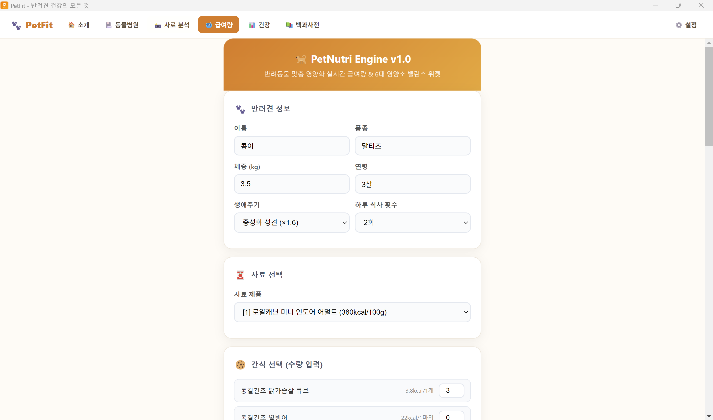
      <br>
      <sub><b>Profile & Food Input</b></sub>
    </td>
    <td width="33.3%" align="center">
      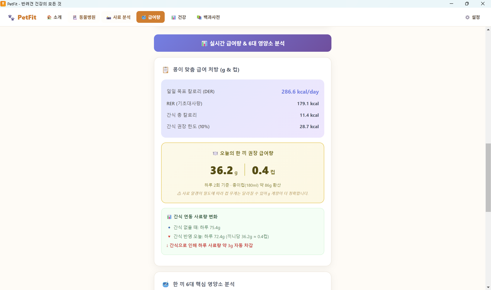
      <br>
      <sub><b>Feeding Amount Result</b></sub>
    </td>
    <td width="33.3%" align="center">
      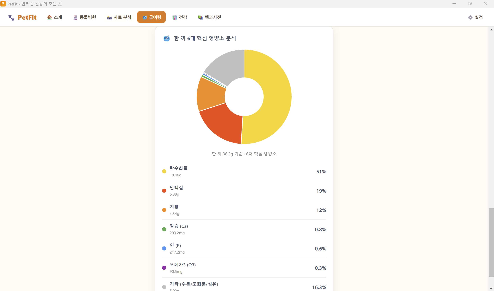
      <br>
      <sub><b>Nutrient Analysis</b></sub>
    </td>
  </tr>
</table>

### Energy Calculation

```text
RER = 70 × Weight(kg)^0.75
DER = RER × Life Stage Factor
```

생애주기 계수에는 다음 상태를 반영합니다.

* 중성화 성견
* 미중성화 성견
* 성장기
* 노령견
* 비만 경향
* 체중 감량 필요
* 높은 활동량

사료의 `kcal / 100 g` 정보를 이용하여 하루 사료량을 계산하고,
식사 횟수를 기준으로 **1회 급여량(g / cup)** 까지 제공합니다.

또한 입력한 간식 칼로리를 DER에 반영하며,

```text
Recommended Treat Calories ≤ 10% of DER
```

기준을 초과하면 사용자에게 경고합니다.

---

## 3. Rule-based Health Profile & Risk Visualization

현재 건강·생활 입력값과 견종 특성을 조합하여
반려견의 생활패턴과 주요 건강 위험요소를 규칙 기반으로 평가합니다.

<table>
  <tr>
    <td width="50%" align="center">
      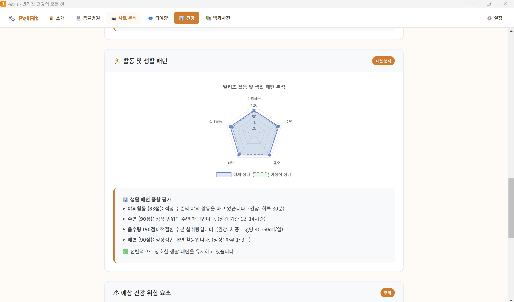
      <br>
      <sub><b>Activity & Lifestyle Radar</b></sub>
    </td>
    <td width="50%" align="center">
      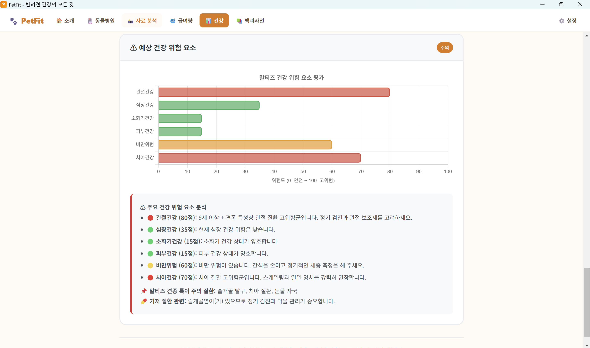
      <br>
      <sub><b>Health Risk Evaluation</b></sub>
    </td>
  </tr>
</table>

### Lifestyle Analysis

다음 항목을 점수화하여 현재 상태와 기준 상태를 Radar Chart로 비교합니다.

* 야외 활동
* 수면
* 음수량
* 배변 상태
* 실내 활동

### Health Risk Evaluation

반려견의 현재 정보와 견종 특성을 이용해 주요 위험 요소를 0–100 범위로 표현합니다.

* 관절 건강
* 심장 건강
* 소화기 건강
* 피부 건강
* 비만 위험
* 치아 건강

> 이 기능은 의료 진단 모델이 아니라, 입력된 정보와 사전에 정의한 규칙을 기반으로 위험 요소를 시각화하는 프로토타입입니다.

---

## 4. Location-based Veterinary Hospital Search

브라우저의 현재 위치 또는 사용자가 선택한 위치를 기준으로 주변 동물병원을 탐색합니다.

<table>
  <tr>
    <td width="50%" align="center">
      
      <br>
      <sub><b>Veterinary Hospital Map</b></sub>
    </td>
    <td width="50%" align="center">
      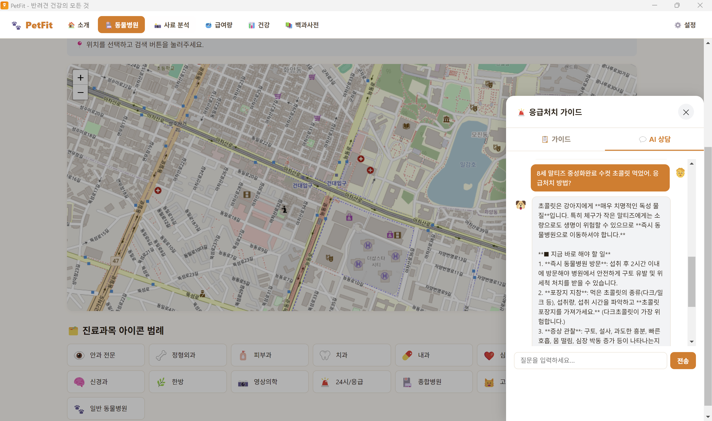
      <br>
      <sub><b>Emergency Guide & AI Consultation</b></sub>
    </td>
  </tr>
</table>

### Map Pipeline

```text
Browser Geolocation / Manual Location
                ↓
        Kakao Local REST API
                ↓
      Veterinary Place Search
                ↓
        Leaflet Map Rendering
                ↓
         OpenStreetMap Tiles
```

검색된 병원명에 포함된 키워드를 이용해 다음과 같은 진료과목 정보도 분류하여 표시합니다.

`안과 · 정형외과 · 피부과 · 치과 · 내과 · 심장 · 종양 · 신경 · 영상의학 · 24시/응급 · 특수동물`

---

## 5. Emergency Guide & Gemini Consultation

동물병원 지도 화면에서 응급상황별 가이드와 AI 상담 패널을 바로 열 수 있습니다.

주요 응급상황에 대해

* 즉시 해야 할 행동
* 피해야 할 행동
* 병원 방문 필요성

을 제공하며, 선택한 응급상황을 문맥으로 활용하여 Gemini 기반 질의를 이어갈 수 있습니다.

> AI 상담 결과는 참고 정보이며 수의사의 진료를 대체하지 않습니다.

---

## 6. Dog Encyclopedia & AI Search

견종·질병·음식 정보를 검색할 수 있는 로컬 지식 DB를 구성했습니다.

<p align="center">
  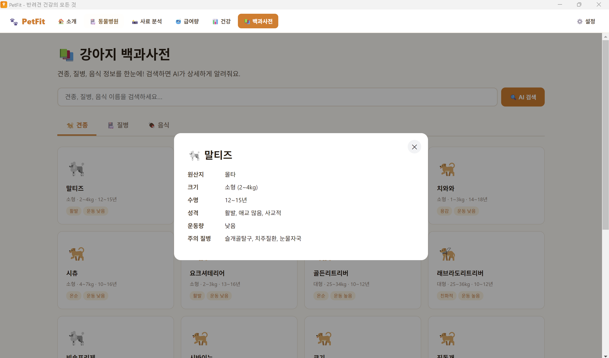
  <br>
  <sub><b>Dog Encyclopedia</b> — 견종 카드 및 상세 정보 조회</sub>
</p>

백과사전에서는 견종·질병·음식 카테고리를 탐색할 수 있으며,
견종을 선택하면 원산지, 크기, 수명, 성격, 운동량, 주의 질병 등 상세 정보를 확인할 수 있습니다.

검색 과정은 먼저 로컬 데이터베이스에서 관련 정보를 조회하고,
Gemini API Key가 설정된 경우 AI 설명을 추가로 제공합니다.

```text
User Query
   │
   ├── Local Knowledge DB
   │       └── Breed / Disease / Food
   │
   └── Gemini AI Search
           └── Additional Explanation
```

---

# Web & Desktop Build Architecture

PetFit은 기능별 HTML / CSS / JavaScript 파일을 독립적으로 개발한 뒤
하나의 HTML로 합쳐 Electron 애플리케이션으로 패키징할 수 있도록 구성했습니다.

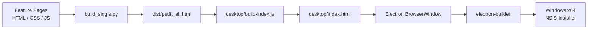

Electron 환경에서는 `contextIsolation`을 활성화하고 `nodeIntegration`을 비활성화했으며,
API 설정은 renderer에 직접 Node.js 권한을 노출하지 않고 IPC를 통해 처리하도록 구성했습니다.

---

# Tech Stack

| Category            | Technologies                       |
| ------------------- | ---------------------------------- |
| **Frontend**        | HTML5, CSS3, Vanilla JavaScript    |
| **AI / Multimodal** | Google Gemini API                  |
| **Visualization**   | Chart.js                           |
| **Map**             | Leaflet, OpenStreetMap             |
| **Location Search** | Kakao Local REST API               |
| **Local Data**      | JavaScript Static DB, LocalStorage |
| **Desktop**         | Electron, electron-builder         |
| **Build**           | Python, Node.js                    |
| **Deployment**      | Netlify                            |

---

# Business Model & Monetization Strategy

PetFit은 반려견 맞춤 건강관리 경험을 중심으로 사용자를 확보한 뒤,
**사료 추천·동물병원 연계·데이터 인사이트·프리미엄 기능**으로 수익원을 확장할 수 있도록 비즈니스 모델을 설계할 수 있습니다.

```text
                    PetFit Users
                         │
             Personalized Pet Health Data
                         │
       ┌─────────────────┼─────────────────┐
       │                 │                 │
       ▼                 ▼                 ▼
 Pet Food Brands   Veterinary Clinics   Data / Insights
       │                 │                 │
 Sponsored /       Premium Listing /     B2B Analytics /
 Affiliate Revenue   Partnership          Data Partnership
       │                 │                 │
       └─────────────────┼─────────────────┘
                         ▼
                PetFit Revenue Model
```

## 1. Sponsored Food Recommendation & Affiliate Revenue

PetFit의 사료 분석 결과에서 제공되는 **추천 사료 TOP 3 영역**을 활용하여
사료 제조사·유통사와 광고 또는 제휴 수익 모델을 구성할 수 있습니다.

가능한 수익 구조:

* 추천 결과 내 **Sponsored Product** 노출
* 사료 브랜드의 프로모션 캠페인
* 제품 상세 페이지 / 구매 링크 연계에 따른 Affiliate Commission
* 건강관리 목표별 브랜드 프로모션
* 신규 사료 체험단 및 샘플링 프로그램 연계

단, 서비스 신뢰성을 유지하기 위해 **PetFit Match 점수 자체와 광고 노출은 분리**하는 것을 전제로 합니다.
광고 상품은 명확하게 `Sponsored`로 표시하고, 알고리즘 점수를 광고비에 따라 조작하지 않는 구조가 필요합니다.

---

## 2. Veterinary Clinic Partnership & Premium Listing

현재 구현된 주변 동물병원 지도 기능을 확장하여
동물병원을 대상으로 한 **B2B2C 프리미엄 연계 모델**을 구성할 수 있습니다.

예를 들어:

* 지도 내 **Premium Clinic Listing**
* 전문 진료과목 및 의료진 정보 강조 노출
* 24시간·응급·정형외과·피부과 등 상세 필터
* 진료 예약 및 상담 연결
* 병원별 건강검진·예방접종·영양상담 프로그램 연계
* 위치 기반 병원 광고
* PetFit 사용자 대상 병원 프로모션

향후 사용자의 건강 프로필과 병원의 진료 분야를 연결하면
단순 거리 기반 검색을 넘어 **필요 진료 분야 기반 병원 추천**으로 확장할 수 있습니다.

---

## 3. B2B Data & Pet-health Insight Business

서비스 이용자가 충분히 확보되면 축적되는 데이터를 기반으로
반려동물 산업의 다양한 사업자에게 **통계·트렌드 기반 B2B 인사이트**를 제공할 수 있습니다.

활용 가능한 분석 예시:

* 견종·연령별 주요 건강관리 관심사
* 지역별 반려견 건강 관련 수요
* 사료 영양성분 및 선호도 트렌드
* 알레르기·체중관리·관절관리 등 건강 목표별 시장 수요
* 제품별 사용자 적합성 및 선택 패턴
* 반려견 생애주기별 영양관리 트렌드

잠재적인 B2B 고객:

* Pet Food / Pet Healthcare 기업
* 동물병원 및 동물의료 네트워크
* 반려동물 보험사
* 반려동물 헬스케어 스타트업
* 시장조사·연구기관

> 데이터 비즈니스는 **사용자의 명시적 동의, 개인정보 보호, 비식별화 및 집계 처리**를 전제로 하며,
> 개별 사용자의 원본 건강정보를 직접 판매하는 방식이 아니라 통계적·비식별 인사이트를 제공하는 방향을 목표로 합니다.

---

## 4. Premium Subscription

장기적으로 사용자 계정과 건강 데이터가 구축되면
개인 사용자를 대상으로 한 구독형 모델도 확장할 수 있습니다.

예상 Premium 기능:

* 장기 체중·건강 변화 Tracking
* 급여 및 건강관리 기록 자동 저장
* 맞춤 건강 리포트
* 예방접종 / 투약 / 건강검진 Reminder
* 광고 없는 환경
* 더 상세한 사료 비교
* AI 상담 사용량 확대
* Pet Health Passport

```text
Free User
   │
   ├── Food Analysis
   ├── Feeding Calculator
   ├── Vet Map
   └── Basic Health Information
             │
             ▼
       Premium Subscription
             │
   ├── Longitudinal Tracking
   ├── Advanced Health Report
   ├── Smart Reminder
   ├── Extended AI Features
   └── Pet Health Passport
```

---

## 5. B2B API / Recommendation Engine Licensing

PetFit의 개인화 점수 계산 및 Safety Gate 구조를 고도화하면
향후 외부 펫커머스·보험·헬스케어 서비스에서 사용할 수 있는 **B2B API 또는 추천 모듈** 형태로 확장할 수 있습니다.

예:

```text
Partner Service
      ↓
Dog Profile + Food Data
      ↓
PetFit Recommendation API
      ↓
Match Score + Safety Result
```

이를 통해 PetFit 자체 앱의 사용자 수익뿐 아니라
외부 플랫폼에 추천 엔진을 제공하는 **SaaS/API 기반 수익 모델**도 고려할 수 있습니다.

---

# Repository Structure

```text
PetFit-AI/
├── index.html
│
├── pages/
│   ├── landing.html
│   ├── food_analysis.html
│   ├── feeding.html
│   ├── healthcare.html
│   ├── vet_map.html
│   └── encyclopedia.html
│
├── assets/
│   ├── css/
│   │   ├── styles.css
│   │   ├── food_style.css
│   │   ├── feeding_style.css
│   │   └── healthcare_style.css
│   │
│   └── js/
│       ├── app.js
│       ├── food_db.js
│       └── healthcare_app.js
│
├── scripts/
│   └── build_single.py
│
├── desktop/
│   ├── main.js
│   ├── preload.js
│   ├── build-index.js
│   ├── create-icon.js
│   ├── icon.png
│   └── package.json
│
├── docs/
│   ├── images/
│   │   ├── screenshots/
│   │   └── certificates/
│   └── certificates/
│
├── config.example.js
├── .gitignore
└── README.md
```

---

# Getting Started

## 1. Clone Repository

```bash
git clone https://github.com/dy0908ky/PetFit-AI.git
cd PetFit-AI
```

## 2. Run Local Web Server

```bash
python -m http.server 8000
```

브라우저에서 다음 주소를 엽니다.

```text
http://localhost:8000
```

## 3. Gemini API Configuration

```text
config.example.js
        ↓ copy
config.js
```

`config.js`에 본인의 Gemini API Key를 입력합니다.

```javascript
const GEMINI_API_KEY = "YOUR_GEMINI_API_KEY";
```

`config.js`는 `.gitignore`에 포함되어 있으므로 공개 저장소에 업로드되지 않습니다.

Kakao Local API를 사용하는 동물병원 검색 기능은 화면에서
사용자의 **Kakao REST API Key**를 입력하여 실행합니다.

---

# Desktop Build

먼저 단일 HTML을 생성합니다.

```bash
python scripts/build_single.py
```

생성 결과:

```text
dist/petfit_all.html
```

이후 Electron 앱을 빌드합니다.

```bash
cd desktop
npm install
node build-index.js
npm run build
```

Windows 설치 파일은 다음 경로에 생성됩니다.

```text
desktop/dist/
```

---

# Engineering Considerations / Limitations

현재 PetFit은 **서비스 아이디어와 사용자 흐름을 검증하기 위한 프로토타입**으로 다음 한계가 있습니다.

* Gemini 및 Kakao API가 현재 프론트엔드에서 직접 호출되므로 실제 서비스에서는 Backend Proxy가 필요합니다.
* 사료 추천 후보는 실시간 상용 제품 데이터베이스가 아닌 프로토타입 정적 DB를 사용합니다.
* `Feeding Experience` 항목은 장기 급여 이력과 아직 연동되지 않았으며 현재 중립값으로 처리됩니다.
* 건강 분석은 의료 AI 진단 모델이 아니라 입력값과 견종 기준을 이용한 규칙 기반 분석입니다.
* 체중 변화 시계열은 실제 장기 사용자 기록 DB가 아닌 프로토타입 시각화입니다.
* 사료 적합도 및 건강 결과에 대한 수의학 전문가 검증과 정량적 성능평가가 추가로 필요합니다.
* 사용자 계정 및 클라우드 기반 데이터 동기화는 아직 구현하지 않았습니다.

---

# Future Work

* 🗄️ 사용자 계정 및 장기 건강 데이터베이스 구축
* 📈 실제 체중·활동·식이 이력을 이용한 Longitudinal Health Tracking
* 🐕 실제 상용 사료 제품 DB 및 최신 영양정보 연동
* 🔐 Backend Proxy를 통한 API Key 보호
* 🩺 수의학 전문가 검증 및 추천 알고리즘 정량 평가
* 📄 Pet Health Passport 구축
* 🏥 수의사와의 건강·식이정보 공유 및 진료 결과 연동
* 📱 모바일 환경 최적화
* 🧠 장기 사용자 피드백 기반 Feeding Experience Score 개인화
* 💳 Premium Subscription 및 B2B API 사업모델 검증
* 📊 개인정보 보호를 전제로 한 비식별 Pet-health Data Insight 구축

---

# Project Background

PetFit은 **AI SPARK Bootcamp 3기**에서 반려동물 건강관리 문제를 AI 서비스로 구현한 프로젝트입니다.

프로젝트 개발 과정에서 생성형 AI 활용과 함께 Prompt Engineering, Responsible AI 등 관련 교육을 이수했습니다.

### AI SPARK Bootcamp

<p align="center">
  
</p>

### Related AI Training

<table>
  <tr>
    <td width="33.3%" align="center">
      
      <br>
      <sub><b>Foundations of Prompt Engineering</b></sub>
    </td>
    <td width="33.3%" align="center">
      
      <br>
      <sub><b>Generative AI for Executives</b></sub>
    </td>
    <td width="33.3%" align="center">
      
      <br>
      <sub><b>Responsible Artificial Intelligence Practices</b></sub>
    </td>
  </tr>
</table>

원본 수료증 파일은 [`docs/certificates/`](docs/certificates/)에서 확인할 수 있습니다.

---

# Portfolio Summary

PetFit은 단순히 생성형 AI API를 호출하는 데 그치지 않고,

```text
Multimodal Input
      ↓
Structured AI Analysis
      ↓
Deterministic Scoring
      ↓
Safety Filtering
      ↓
Rule-based Health Logic
      ↓
Visualization & User Interface
```

로 이어지는 **AI 기반 의사결정 지원 서비스의 전체 흐름을 직접 프로토타이핑하는 것**을 목표로 했습니다.

이를 통해 이미지 기반 정보 추출, AI 응답 구조화, 개인화 점수 설계, 규칙 기반 안전성 검사,
건강정보 시각화, 외부 위치 API 연동, 웹·데스크톱 패키징까지 하나의 서비스 안에서 통합했습니다.

기술 구현뿐 아니라 추천 사료 광고·동물병원 연계·B2B 데이터 인사이트·프리미엄 구독 등
**서비스가 실제 비즈니스로 확장될 수 있는 수익모델까지 함께 설계**했다는 점에 의미가 있습니다.

---

## Disclaimer

PetFit의 모든 사료 적합도, 급여량, 건강 위험도 및 AI 상담 결과는
**교육 및 프로토타입 검증을 위한 참고 정보**입니다.

실제 질병 진단, 치료, 처방 및 식이 변경은 반드시 수의사와 상담해야 합니다.
